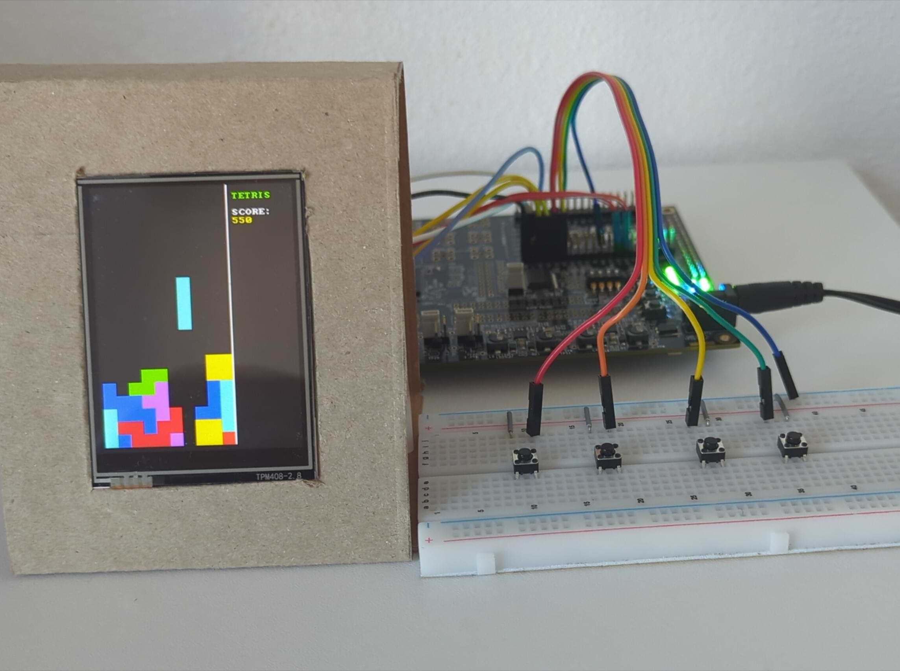

# Bare-Metal Tetris

To showcase the capabilities of the hardware, a Tetris implementation was
written in bare-metal C.

{ align=left }

## Hardware setup

The Lattice ECP5 evaluation board is connected via SPI to a 2.8" LCD display
(driven by an ILI9341 controller) and to four breadboard-mounted pushbuttons
for game control.

All external peripherals are wired to the Versa J39 expansion header, which is
configured for 3.3V logic (LVCMOS33). The physical pin mappings defined in the
`.lpf` [constraint file] are as follows:

[constraint file]: https://github.com/GBergatto/via-honoris/blob/main/virtus-rv/fpga/ecp5evn.lpf

**SPI Display Controller**

- Clock (`spi_sclk`): `D15`
- MOSI (`spi_mosi`): `B15`
- Data/Command (`spi_dc`): `C15`
- Chip Select (`spi_cs_n`): `B13`
- Reset (`spi_reset_n`): `B20`

**GPIO Buttons (Internal Pull-Up)**

- `button[0]`: `D11`
- `button[1]`: `E11`
- `button[2]`: `B12`
- `button[3]`: `C12`

## Bare-Metal C Environment

Since no operating system or standard C library is available, the project
requires a basic software infrastructure to compile via GCC and execute
directly on the hardware.

### Linker Script

The [linker script] instructs the compiler on how to map different types of
data into physical memory.

[linker script]: https://github.com/GBergatto/via-honoris/blob/main/sw/bsp/link.ld

The memory origin is set to `0x8000_0000`, matching the base address of the
system BRAM.

```ld
MEMORY
{
  BRAM (rwx) : ORIGIN = 0x80000000, LENGTH = 64K
}
```

The script defines the standard sections:

- `.text`: Machine code
- `.data`: Initialized variables
- `.bss`: Uninitialized variables

It also provides the end-of-stack symbol (`_estack`), pointing to the top of
the memory, and `__global_pointer$` to enable GCC's relaxed addressing
optimization.

### Bootloader

A minimal assembly [bootloader] prepares the hardware before handing control
over to the C `main()` function.

[bootloader]: https://github.com/GBergatto/via-honoris/blob/main/sw/bsp/crt0.s


```asm
_start:
    .option push
    .option norelax
    la gp, __global_pointer$
    .option pop

    # Initialize stack pointer to top of 64KB BRAM
    la sp, _estack

    # Clear the BSS section
    la a0, _sbss
    la a1, _ebss
    bgeu a0, a1, 2f
1:
    sw zero, 0(a0)
    addi a0, a0, 4
    bltu a0, a1, 1b
2:

    # Call main
    jal ra, main
```

This routine initializes the stack pointer (`sp`) and the global pointer
(`gp`). Most importantly, it zeroes out the `.bss` section in memory. Without
this step, uninitialized global variables would contain unpredictable garbage
data left over in the RAM upon power-up, leading to runtime instability.

### Software Math Routines

The foundational RV32I core implemented in this project does not include the
hardware "M" extension. However, standard game logic inevitably relies on
multiplication and division (e.g., for coordinate computations, or for
selecting the Tetrominoes at random).

To resolve this, utility functions implementing these operations in software
(such as `__mulsi3` and `__modsi3`) are included in the source. When GCC
encounters a multiplication or modulo operation, it substitutes a call to these
functions, allowing the core to emulate the missing hardware instructions.
While these are often provided by compiler built-ins, they are explicitly
bundled in the source tree to prevent linking issues across different host
toolchains.

## Bare-Metal Drivers

To keep the core game logic clean, direct interactions with the SoC's custom
hardware are encapsulated into dedicated bare-metal drivers, which are tightly
coupled to the specific memory-mapped registers of the physical peripherals.

### Timer

Real-time games cannot rely on blocking delay loops, as they would freeze
button polling. Instead, the [timer driver] provides a `timer_get_ticks()`
function that directly reads the hardware `mtime` register from the CLINT.

[timer driver]: https://github.com/GBergatto/via-honoris/blob/main/sw/libs/timer.c

```c
#define MTIME_LOW *((volatile uint32_t *)0x0200BFF8)

uint32_t timer_get_ticks(void) {
    return MTIME_LOW;
}
```

This allows the main game loop to run continuously, polling inputs and
calculating deltas, while only updating the game state when the required time
delta has elapsed.

### Buttons

The [buttons driver] abstracts the memory-mapped read operation for the
physical inputs.

[buttons driver]: https://github.com/GBergatto/via-honoris/blob/main/sw/libs/buttons.c

```c
#define BUTTONS_REG *((volatile uint32_t *)0x04000000)

uint32_t btn_read(void) {
    return BUTTONS_REG;
}
```

Because the underlying hardware peripheral automatically handles clock-domain
synchronization and logic inversion, the software simply reads a clean `1` when
a button is pressed, despite the physical active-low pull-up configuration.

### Display Driver (ILI9341)

The [display driver] leverages the custom SPI Controller Wishbone module to
initialize the screen and transmit 16-bit RGB565 pixel data.

[display driver]: https://github.com/GBergatto/via-honoris/blob/main/sw/libs/ili9341.c

#### Hardware Communication

The driver interfaces with the SPI Controller using strictly typed
memory-mapped pointers:

```c
#define SPI_DATA_8  *((volatile uint8_t  *)0x03000000)
#define SPI_DATA_16 *((volatile uint16_t *)0x03000000)
#define SPI_CTRL    *((volatile uint32_t *)0x03000004)
```

The ILI9341 uses a 4-wire SPI protocol. Alongside the standard clock, MOSI, and
Chip Select (`cs_n`) lines, it requires a Data/Command (`dc`) pin to
differentiate between configuration commands and raw payload data. The driver
abstracts this into simple primitives:

```c
static void spi_cmd(uint8_t cmd) {
	SPI_CTRL = CTRL_RST_N; // DC = 0 (Command)
	SPI_DATA_8 = cmd;
}

static void spi_data16(uint16_t data) {
	SPI_CTRL = CTRL_RST_N | CTRL_DC; // DC = 1 (Data)
	SPI_DATA_16 = data;
}
```

Notice the distinction between `SPI_DATA_8` and `SPI_DATA_16`. By casting the
base address to an 8-bit or 16-bit pointer, the GCC compiler is forced to issue
a Store Byte (`sb`) or Store Halfword (`sh`) instruction, respectively. The
Wishbone bus translates this into hardware byte-select lanes (`wb_sel_i`),
allowing the SPI Controller to dynamically shift out an 8-bit or 16-bit
payload.

#### Display Initialization

Initializing the display requires a specific sequence:

1. **Hardware Reset**: Assert the physical `reset_n` pin via the `SPI_CTRL`
   register, pause, and release it.
2. **Software Wakeup**: Send the Sleep Out command (`0x11`) and delay to allow
   the internal voltage boosters to stabilize.
3. **Color Format**: Send the Pixel Format Set command (`0x3A`) with a
   parameter of `0x55` to configure the screen for 16-bit colors (RGB565).
4. **Memory Access Control**: Send the `MADCTL` command (`0x36`) with `0x08`.
   This maps the internal hardware origin (X=0, Y=0) to the physical top-left
   of the display and specifies the BGR color byte-ordering.

#### Drawing Primitives

The ILI9341 relies on "Drawing Windows". To paint a pixel or a shape, the
driver must first define the boundary of the update area.

To draw a rectangle, the driver issues a Column Address Set (`0x2A`) and a Page
Address Set (`0x2B`), sending the starting and ending X/Y coordinates as 16-bit
payloads.

```c
spi_cmd(0x2A);
spi_data16(x);
spi_data16(x2);
```

Once the window is defined, the Memory Write command (`0x2C`) is issued. The
driver can then continuously stream 16-bit colors to the SPI controller. The
ILI9341 automatically advances its internal memory pointer, wrapping around the
boundaries of the defined window until it is filled.

#### Delta rendering

To accommodate the limited bandwidth of the 6MHz SPI bus, the game relies on
**delta rendering**. Instead of redrawing the entire screen every frame, it
maintains a background array of the current display state. The game loop
calculates the next frame's layout, compares it against the cache, and only
executes the drawing primitives for the specific 16x16 Tetris blocks that have
changed. This software optimization prevents bus saturation and maintains a
stable framerate.

