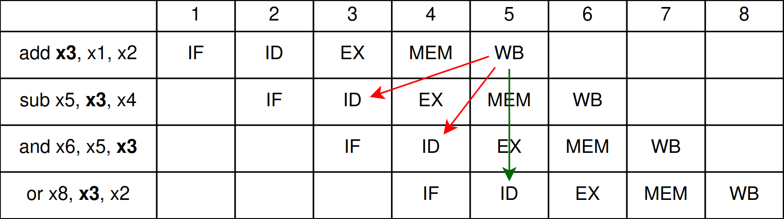

# Pipeline 

The core implements a classic 5-stage, single-issue, in-order pipeline.

- **Fetch (IF)**: Issues read requests to the instruction memory interface and
computes the next sequential Program Counter.    
- **Decode (ID)**: Translates the fetched instruction into datapath control
signals, extracts immediate values, reads source operands from the register
file, and identifies traps or CSR accesses.
- **Execute (EX)**: Performs arithmetic and logical operations via the ALU,
resolves branch conditions, computes target addresses for branches and jumps,
and formats CSR write data.
- **Memory (MEM)**: Interfaces with the data memory for loads and stores,
natively handling sub-word store masking.
- **Writeback (WB)**: Performs sub-word load alignment, selects the final
operation result, commits it to the register file, and resolves hardware
context switches (traps/returns) by redirecting the PC.

## Data Hazards

In a pipelined architecture, a data hazard occurs when an instruction depends
on the result of a previous instruction that has not yet committed its data to
the register file.

To illustrate this, consider the following sequence of instructions:

{ align=left }

The `sub` and `and` instructions read the `x3` register at cycle 3 and 4,
respectively, while `add` commits its result to the register file in cycle 5.
This means that the two following instructions will read the wrong value of
`x3` and therefore produce an incorrect result. Note that the `or` instruction
will read the correct result, but only because the [register file] is
specifically designed to be written in the first half of the clock cycle and
read in the second half of the clock cycle.

[register file]: microarchitecture/#register-file

In order for this program to execute correctly, we would have to stall the
first half of the pipeline until the `add` instruction commits its result to
the register file. To determine the presence of a stall, the core originally
required hazard detection logic that compared the source registers in the
Decode stage against the destination registers of older instructions in the
Execute, Memory, and Writeback stages:

```systemverilog
assign stall =
   // Compare Decode to Execute
   (rd_E != 0 && ctrl_E.reg_write &&
      (rs1_D == rd_E || (rs2_used && rs2_D == rd_E))) ||

   // Compare Decode to Memory
   (rd_M != 0 && ctrl_M.reg_write &&
      (rs1_D == rd_M || (rs2_used && rs2_D == rd_M))) ||

   // Compare Decode to Writeback
   (rd_W != 0 && ctrl_W.reg_write &&
      (rs1_D == rd_W || (rs2_used && rs2_D == rd_W)));
```

However, implementing the internal write-through of the register file rendered
the comparison against the Writeback stage redundant (for reference, see [this
commit]).

[this commit]: https://github.com/GBergatto/via-honoris/commit/8618d29036776c5a90982dd16e1e16fde7ed52ac

### Forwarding

To further reduce the number of stalls in the pipeline, data forwarding was
introduced [here]. At a high level, the forwarding logic routes the results
computed in the Memory or Writeback stages directly into the Execute stage if
those results are destined for the same registers that the instruction
currently in the Execute stage has just read. While the Decode stage still
fetches data from the potentially outdated register file, the forwarding
multiplexers dynamically inject the newly computed values directly into the ALU
inputs, replacing the stale data.

[here]: https://github.com/GBergatto/via-honoris/commit/63cc7263d441d76f0febbac587038d772e100180

```systemverilog
logic [1:0] forward_a_E, forward_b_E;

// Forwarding for source op1
always_comb begin
   if (rd_M != 0 && rs1_E == rd_M && ctrl_M.reg_write) begin
      forward_a_E = 2'b10; // Forward from MEM
   end else if (rd_W != 0 && rs1_E == rd_W && ctrl_W.reg_write) begin
      forward_a_E = 2'b01; // Forward from WB
   end else begin
      forward_a_E = 2'b00; // No Forwarding
   end
end

// Forwarding for source B
always_comb begin
   if (rd_M != 0 && rs2_E == rd_M && ctrl_M.reg_write) begin
      forward_b_E = 2'b10; // Forward from MEM
   end else if (rd_W != 0 && rs2_E == rd_W && ctrl_W.reg_write) begin
      forward_b_E = 2'b01; // Forward from WB
   end else begin
      forward_b_E = 2'b00; // No Forwarding
   end
end

/* Forwarding Multiplexers */
always_comb begin
    case (forward_a_E)
        2'b00: op1 = rs1_data_E; // No forwarding
        2'b01: op1 = result_W;   // Forwarded from Writeback stage
        2'b10: op1 = alu_out_M;  // Forwarded from Memory stage
        default: op1 = rs1_data_E;
    endcase

    case (forward_b_E)
        2'b00: write_data_E = rs2_data_E; // No forwarding
        2'b01: write_data_E = result_W;   // Forwarded from Writeback stage
        2'b10: write_data_E = alu_out_M;  // Forwarded from Memory stage
        default: write_data_E = rs2_data_E;
    endcase
end

```

The forwarding logic evaluates in strict priority order to ensure the most
recent data is used. It first checks if the instruction in the Memory stage
generates a needed operand (`rd_M == rs1_E` and `ctrl_M.reg_write` is active).
If there is a match, it routes the prior ALU result (`alu_out_M`) directly to
the current Execute stage.

If no match exists in the Memory stage, the logic then checks the Writeback
stage (`rd_W == rs1_E`). If a match is found there, the Writeback data
(`result_W`) is forwarded to the Execute stage. If neither condition is met,
the multiplexers simply pass through the original values (`rs1_data_E`,
`rs2_data_E`) read during the Decode stage.

### Load-Use Hazards

The only source of stalls that cannot be prevented via data forwarding is the
Load-Use hazard. This occurs when an instruction depends on a memory load
(e.g., `lw`) that immediately precedes it. Because a load instruction accesses
memory during the Memory stage, its result is not available to be forwarded to
the Execute stage in the same clock cycle.

As a result, the stall detection logic is reduced to this single case:
```systemverilog
assign stall = ctrl_E.mem_read && (rd_E == rs1_D || rd_E == rs2_D);
```

An attentive reader might notice that this exact condition was not present in
the stall detection logic used prior to the implementation of forwarding.
Previously, any uncommitted instruction intending to write to a required source
register necessitated a stall. Therefore, the original logic relied on the
broader `ctrl_E.reg_write` flag, which identifies all instructions that write
to the register file (including loads).

With forwarding now handling standard arithmetic dependencies seamlessly, we
only need to stall for memory loads. Narrowing the condition to
`ctrl_E.mem_read` ensures the pipeline only freezes when it has to wait for
data from memory.

